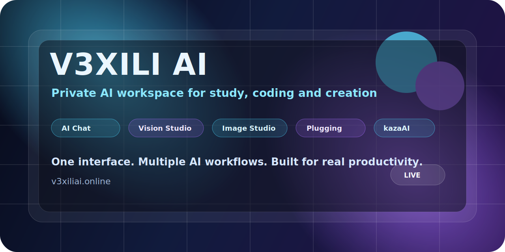

<p align="center">
  
</p>

<h1 align="center">V3XILI AI</h1>

<p align="center">
  <strong>Private AI workspace for study, coding and creation.</strong>
</p>

<p align="center">
  <a href="https://v3xiliai.online"><strong>Open V3XILI AI</strong></a>
  ·
  <a href="./ROADMAP.md">Roadmap</a>
  ·
  <a href="./ANNOUNCEMENT.md">Launch note</a>
  ·
  <a href="https://github.com/v3rx-3/v3xili-ai/issues/new?template=feedback.md">Give feedback</a>
</p>

<p align="center">
  
  
  
  
</p>

---

## What is V3XILI AI?

**V3XILI AI** is a private AI workspace built for students, makers, developers and researchers who want one clean place to work with AI.

Instead of jumping between separate tools for chat, image generation, vision, prompts and workflows, V3XILI AI brings the core creative and productivity flows into one interface.

The focus is practical work:

- study faster
- code with more context
- research and analyze information
- generate images and creative assets
- use smart commands for better outputs
- connect workflows through Plugging

> V3XILI AI is not trying to be another generic chatbot. It is being built as a focused workspace for real tasks.

---

## Core features

| Area | What it does |
| --- | --- |
| **AI Chat** | Study, coding, research, writing and structured reasoning. |
| **Smart Commands** | Commands like `/humanice` and `/x10think` for better control over output style and depth. |
| **Vision Studio** | Image understanding and visual analysis workflows. |
| **Image Studio** | AI image generation for creative and practical use cases. |
| **Plugging** | Connected tools and workflows from a single interface. |
| **Private Workspace** | A cleaner, more focused AI experience for daily work. |
| **kazaAI direction** | Future development agent for long-running coding tasks and project continuity. |

---

## Why it matters

Most AI workflows are fragmented:

```text
chat tool → image tool → vision tool → prompt tool → notes → automation → repeat
```

V3XILI AI is designed around a simpler idea:

```text
one workspace → multiple AI workflows → faster execution
```

This makes it useful for:

- students preparing notes, summaries and explanations
- developers working through code, bugs and project ideas
- makers building content, visuals and product assets
- researchers analyzing information and images
- creators who need text, image and workflow tools together

---

## Smart commands

V3XILI AI includes command-style workflows designed to make AI outputs easier to control.

Examples:

```text
/humanice
```

Makes text sound more natural, clear and human while preserving the original meaning.

```text
/x10think
```

Pushes the assistant toward deeper analysis, better structure and more careful reasoning for complex tasks.

The goal is to make advanced AI behavior accessible without forcing users to write long prompts every time.

---

## Website

V3XILI AI is live here:

**https://v3xiliai.online**

---

## Roadmap

The current public direction is tracked in [`ROADMAP.md`](./ROADMAP.md).

Main priorities:

- improve the core AI workspace
- keep desktop and mobile clean
- expand smart commands
- improve Vision Studio and Image Studio
- add stronger connected workflows through Plugging
- build the first public path toward **kazaAI**

---

## kazaAI: next direction

The next big direction inside the V3XILI ecosystem is **kazaAI**.

kazaAI is planned as a development agent focused on:

- long-running coding sessions
- persistent project memory
- CLI-first workflows
- safe file editing
- debugging and log analysis
- project continuity without losing context

The goal is to create a technical assistant that can help build real software without forcing the user to repeat the same project context again and again.

---

## Feedback wanted

This repository is public so makers, developers and early users can leave feedback.

Useful feedback:

1. Which feature feels most useful?
2. What part of the interface should be improved first?
3. What integrations would make V3XILI AI more useful?
4. Would you use kazaAI more as a CLI or as a visual app?
5. What would make you trust an AI workspace for daily work?

Open feedback here:

**https://github.com/v3rx-3/v3xili-ai/issues/new?template=feedback.md**

---

## Contact

For V3XILI AI support, partnership requests or product questions:

**v3xilisuppor@outlook.com**

For sensitive security reports, please use the contact details in [`SECURITY.md`](./SECURITY.md).

---

## Legal note

© 2026 V3XILI AI. All rights reserved.

V3XILI AI™ is a private AI workspace created by Carlos Sanz.

V3XILI AI is not affiliated with OpenAI, ChatGPT, DALL·E, Anthropic, Claude, Google, Gemini, NVIDIA or any other third-party model provider unless explicitly stated. Third-party names and trademarks belong to their respective owners.

---

<p align="center">
  <strong>V3XILI AI — one clean workspace for study, coding and creation.</strong>
</p>

<p align="center">
  <a href="https://v3xiliai.online">Website</a>
  ·
  <a href="https://github.com/v3rx-3/v3xili-ai/issues">Feedback</a>
  ·
  <a href="./ROADMAP.md">Roadmap</a>
</p>
